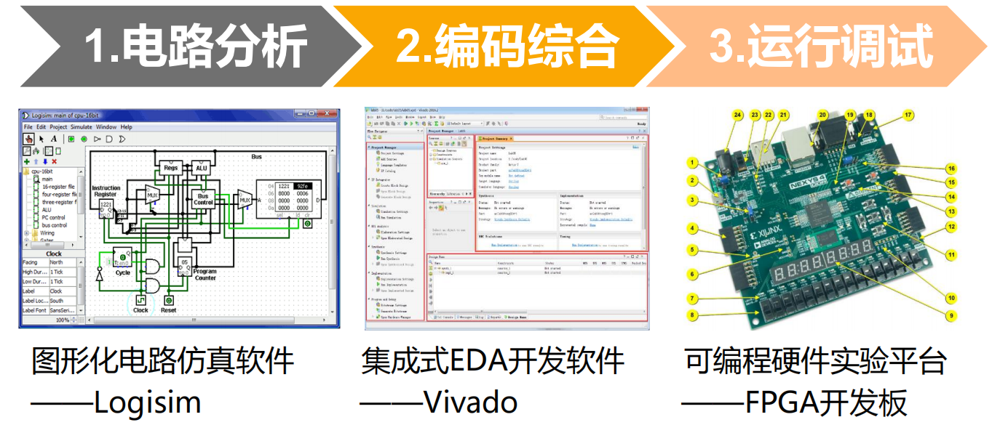

### 反码加法器
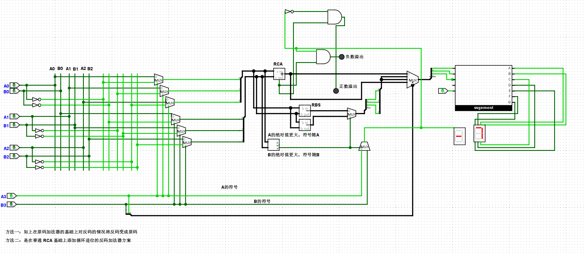

## 补码加法溢出检测的真值表

对于 **符号位** 的全加器，输入为：
- `A_s`: 第一个数的符号位
- `B_s`: 第二个数的符号位
- `C_in`: 来自次高位的进位
- `S_s`: 和的符号位
- `C_out`: 符号位的进位输出

### **真值表**

| A_s | B_s | C_in | S_s | C_out | **溢出判断** |
|-----|-----|------|-----|-------|-------------|
| 0   | 0   | 0    | 0   | 0     | 否 (正+正=正) |
| 0   | 0   | 1    | 1   | 0     | **是** (正+正=负) |
| 0   | 1   | 0    | 1   | 0     | 否 (正+负=正/负，不溢出) |
| 0   | 1   | 1    | 0   | 1     | 否 (正+负=正/负，不溢出) |
| 1   | 0   | 0    | 1   | 0     | 否 (负+正=正/负，不溢出) |
| 1   | 0   | 1    | 0   | 1     | 否 (负+正=正/负，不溢出) |
| 1   | 1   | 0    | 0   | 1     | **是** (负+负=正) |
| 1   | 1   | 1    | 1   | 1     | 否 (负+负=负) |

### **方法1：通过符号位判断**
$$
\text{Overflow} = (\overline{A_s} \cdot \overline{B_s} \cdot S_s) + (A_s \cdot B_s \cdot \overline{S_s})
$$

### **方法2：通过进位判断（更常见）**
观察真值表：
- 当 `C_in ≠ C_out` 时发生溢出
- 即 `C_in XOR C_out = 1`

所以：
$$
\text{Overflow} = C_{in} \oplus C_{out}
$$
其中 `C_in` 是符号位的进位输入（来自次高位），`C_out` 是符号位的进位输出。

### 用D锁存器实现位翻转功能
实例化一个带复位功能的D锁存器, 并将其输出取反后作为输入. 我们预期看到D锁存器的输出将在0和1之间反复变化, 但你应该在仿真过程中看到Oscillation apparent的信息
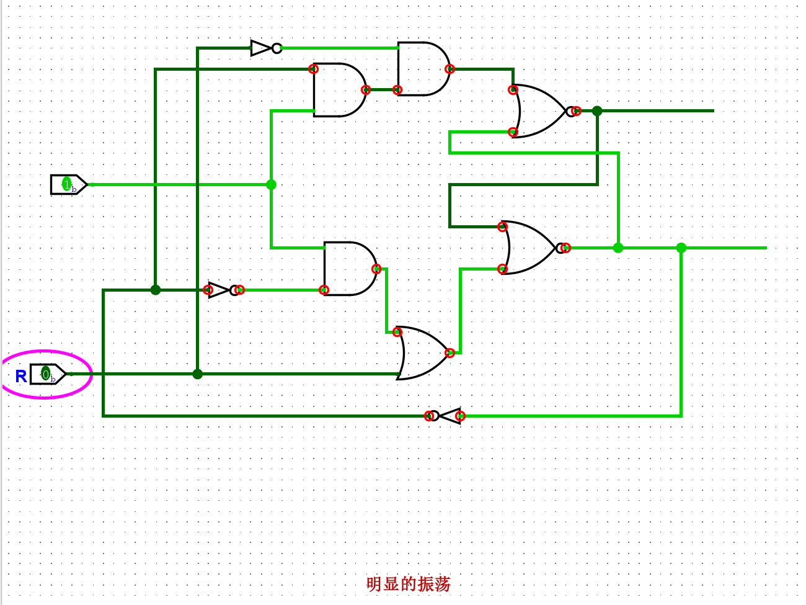

### 同步电路
复杂的系统包含多个模块，需要一种同步关系，控制多个模块协同工作。
同步电路使用全局的周期时钟信号来实现同步，异步电路通过模块之间的局部通信信号来实现同步。
锁存器属于电平触发的存储元件，只要输出发生变化，锁存器立刻感知并输出。
我们需要一种边沿触发(edge-triggered)的存储元件，只有信号边沿到来时，才将输入传播到输出端。

### D触发器
实例化一个带复位功能的D触发器，并将其输出取反后作为输入。我们预期看到D触发器的输出将在0和1之间反复变化，尝试和上文D锁存器的结果进行对比。
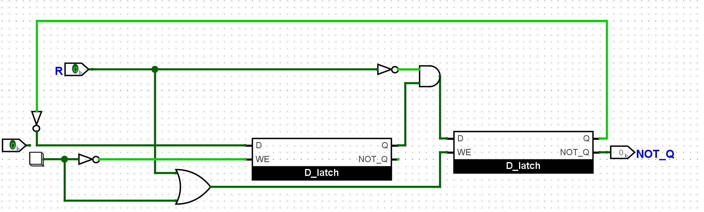
这次翻转会随着边沿触发而改变，不出造成Oscillation apparent。

### 寄存器
上述的D触发器只能存储1位数据，但有时候需要将多位数据作为一个整体来存储和处理。寄存器是由多个D触发器组成 存储元件，其电路结构如下图所示。这些D触发器之间共享相同的时钟信号和使能信号，从而实现整体存储的效果。

数列求和电路：

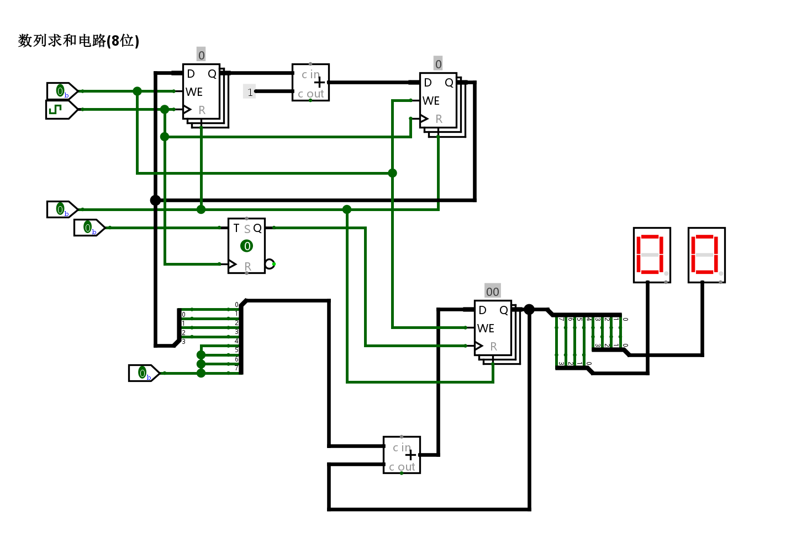
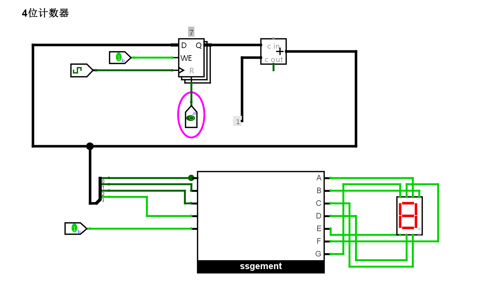

实现电子时钟
利用寄存器和七段数码管, 实现一个电子时钟, 具备"分"和"秒"的功能.

Hint: 使用Clock(时钟)元件可以自动产生时钟信号, 无需像按钮那样手动点击. 你可以在Logisim元件库的Wiring(线路)类别下找到它, 具体使用方式请RTFM.

# F5
### 支持数列求和的简单处理器
 7  6 5  4 3   2 1   0
+----+----+-----+-----+
| 00 | rd | rs1 | rs2 | R[rd]=R[rs1]+R[rs2]       add指令, 寄存器相加
+----+----+-----+-----+
| 10 | rd |    imm    | R[rd]=imm                 li指令, 装入立即数, 高位补0
+----+----+-----+-----+
| 11 |   addr   | rs2 | if (R[0]!=R[rs2]) PC=addr bner0指令, 若不等于R[0]则跳转
+----+----------+-----+

### 实现取指功能
和地址译码器输出相连的导线称为“字线”，每条字线对应一个存储字。
和或门输出相连的导线称为“位线(bit)”，每条位线对应存储字的一位。

给定addr，可以读出ROM中响应的存储字，地址译码器将输入的地址码转换成一组独热码，由于独热码中只有一位有效，故所有字线中，只有地址addr对应的字线有效，使得该行中存储的信息可以通过与门。其余行因字线无效，存放的信息均被与门过滤为0。

被选中的存储字的每一位经过或门传输到位线，向存储器外部输出。

通过多路选择器实现一个ROM, 并在其中存放数列求和的指令序列, 然后通过PC寄存器取出指令. 你需要根据你的理解来确定ROM的规格。

0: li r0, 10   # 这里是十进制的10
1: li r1, 0
2: li r2, 0
3: li r3, 1
4: add r1, r1, r3
5: add r2, r2, r1
6: bner0 r1, 4
7: bner0 r3, 7

PC r0 r1 r2 r3
(0, 0, 0, 0, 0)   # 初始状态
(1, 10, 0, 0, 0)  # 执行PC为0的指令后, r0更新为10, PC更新为下一条指令的位置
(2, 10, 0, 0, 0)  # 执行PC为1的指令后, r1更新为0, PC更新为下一条指令的位置
(3, 10, 0, 0, 0)  # 执行PC为2的指令后, r2更新为0, PC更新为下一条指令的位置
(4, 10, 0, 0, 1)  # 执行PC为3的指令后, r3更新为1, PC更新为下一条指令的位置
(5, 10, 1, 0, 1)  # 执行PC为4的指令后, r1更新为r1+r3, PC更新为下一条指令的位置
(6, 10, 1, 1, 1)  # 执行PC为5的指令后, r2更新为r2+r1, PC更新为下一条指令的位置
(4, 10, 1, 1, 1)  # 执行PC为6的指令后, 因r1不等于r0, 故PC更新为4
(5, 10, 2, 1, 1)  # 执行PC为4的指令后, r1更新为r1+r3, PC更新为下一条指令的位置

10001010    # 0: li r0, 10
10010000    # 1: li r1, 0
10100000    # 2: li r2, 0
10110001    # 3: li r3, 1
00010111    # 4: add r1, r1, r3
00101001    # 5: add r2, r2, r1
11010001    # 6: bner0 r1, 4
11011111    # 7: bner0 r3, 7

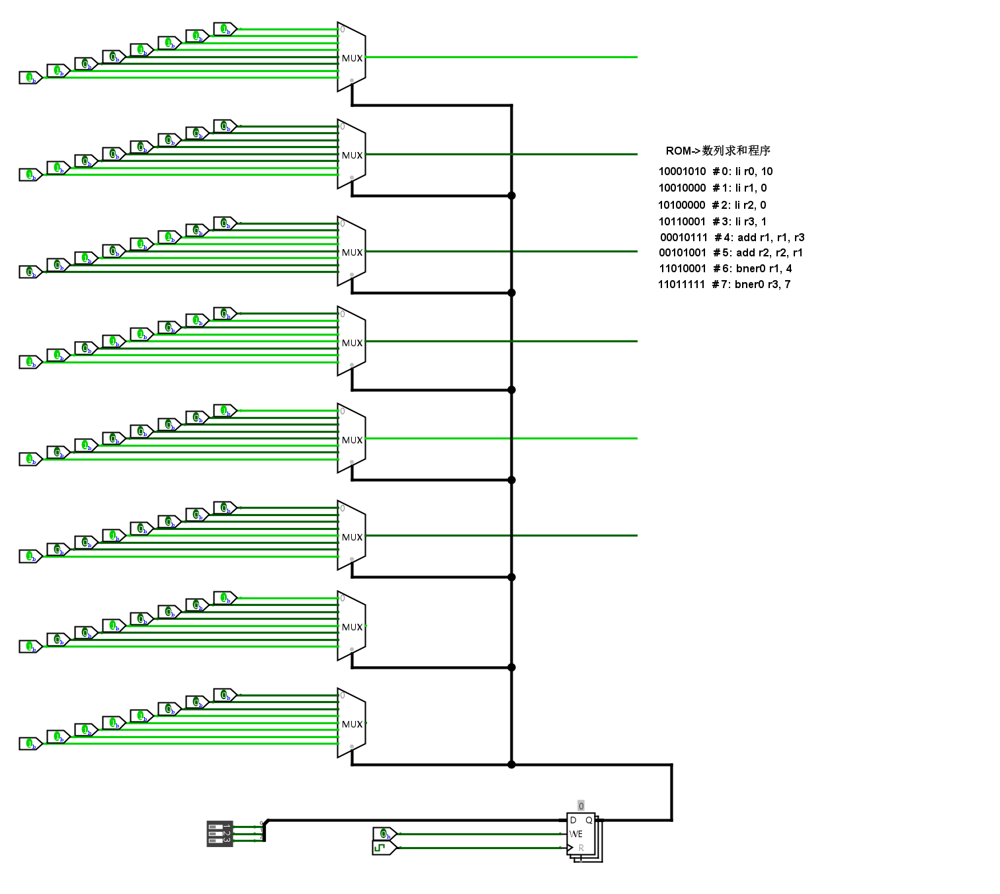

### 译码
从电路角度，译码只是一些位抽取操作。

### 执行
li指令的功能是将立即数`imm`写入`rd`寄存器中，因此需要考虑如何实现ISA的GPR。
RAM的读取功能——数据端为寄存器的多路选择器

### 实现GPR及其写入功能
在寄存器的基础上搭建一个RAM, 从而实现GPR的写入功能. 你需要根据你的理解来确定RAM的规格

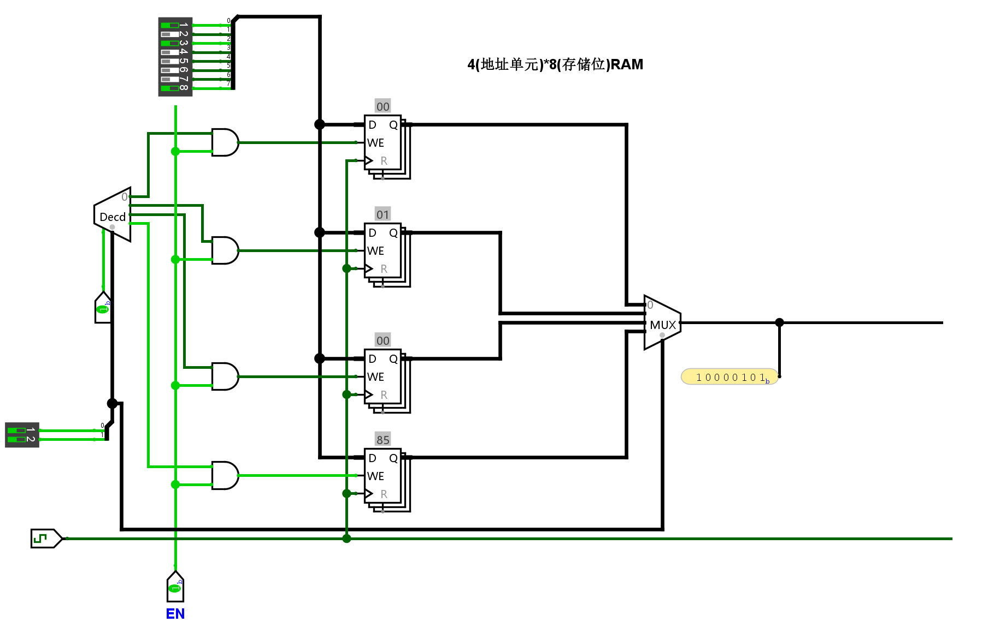

PC最终为7, 且在某GPR中存放求和结果55

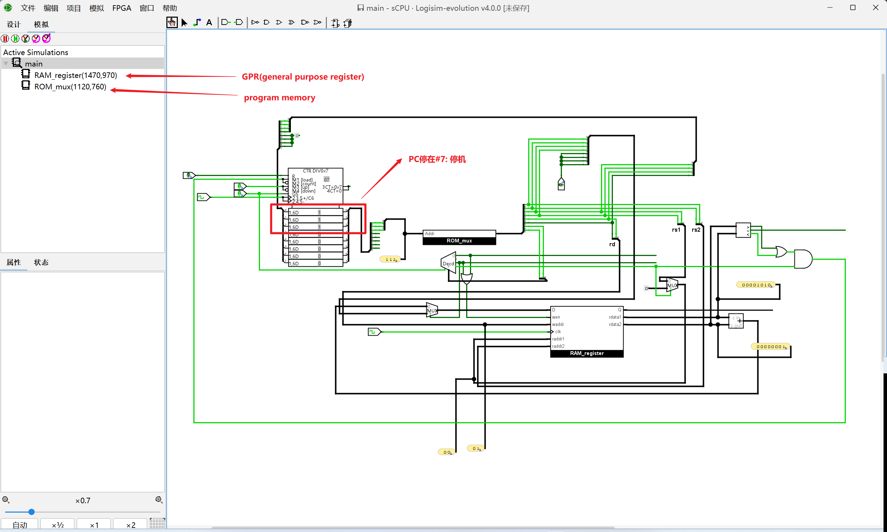

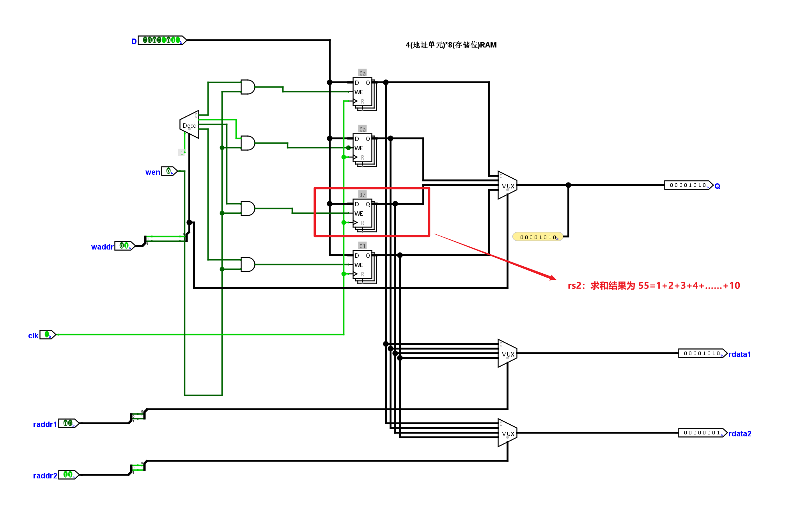

# RISC-V
RISC32I是RISC-V的最小子集。可以模拟几乎所有其它ISA扩展。
### 基础指令格式
在基础的RV32I ISA种，有四种核心的指令格式(R/I/S/U)，都固定在32位长。
IALIGN=32，意味着指令必须在内存中对齐4字节的边界。

### minirv-ISA 规范
了解RISC-V指令集的一些细节之后, 我们就可以给出minirv这一ISA的规范了, 具体如下:

PC初值为0
GPR数量与RV32E中定义的GPR数量一致
支持如下8条指令: add, addi, lui, lw, lbu, sw, sb, jalr
其他的ISA细节与RV32I相同

### 只有两条指令的minirv处理器

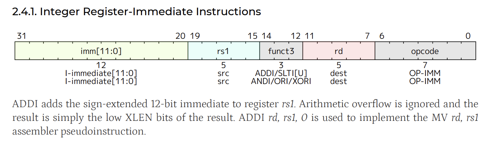

### RISC-V内存
RISC-V线程有$2^XLEN$字节的内存寻址空间。一个内存字是32比特(4字节)，内存地址空间是循环的，因此$2^XLEN - 1$地址处的字节与0地址处的是相邻的。硬件进行忽略溢出完成内存的计算(模$2^XLEN$循环)。

### RV32I Base Instruction Set

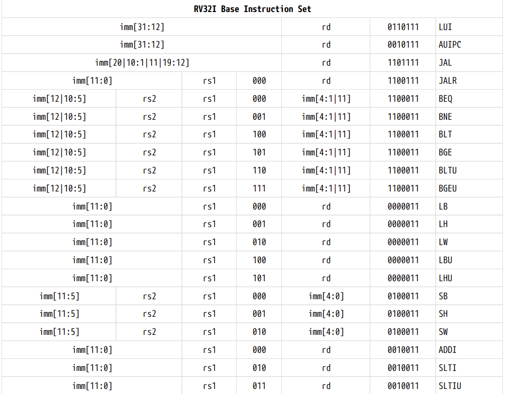
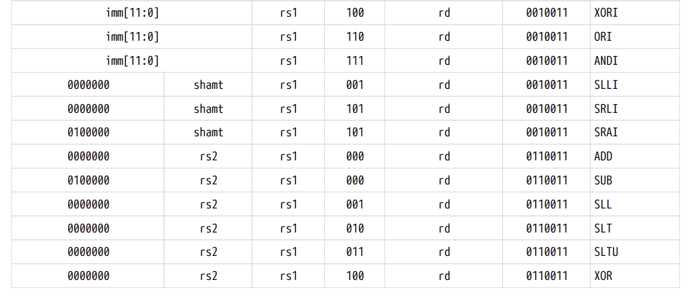
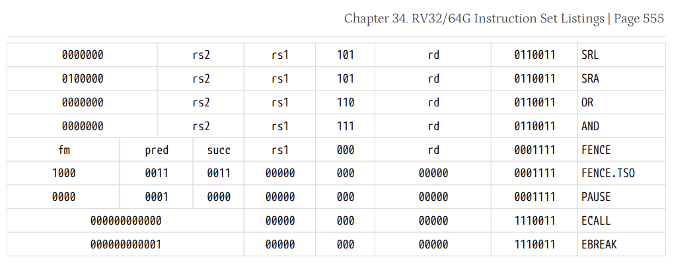

is_jalr = (inst[6:0] == 000) && (inst[14:12] == 1100111)
is_addi = (inst[6:0] == 000) && (inst[14:12] == 0010011)
is_lui =  (inst[14:12] == 0110111)
is_add = (inst[6:0] == 000) && (inst[14:12] == 0110011)
is_lw = (inst[6:0] == 010) && (inst[14:12] == 0000011)
is_sw = (inst[6:0] == 010) && (inst[14:12] == 0100011)
is_lbu = (inst[6:0] == 100) && (inst[14:12] == 0000011)
is_sb = (inst[6:0] == 000) && (inst[14:12] == 0100011)

### ADDI
ADDI指令将12位立即数进行符号扩展后与寄存器rs1的值相加。算术溢出被忽略，运算结果仅保留结果的低XLEN位。
读取：
运算：sign(immediate) + data[rs1]
写入：rd

### JALR
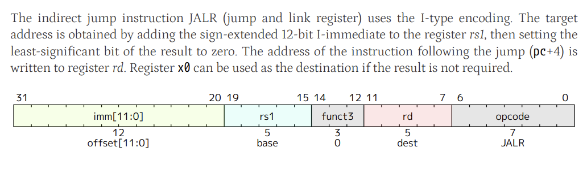
读出：rs1
运算：sign(immediate) + data[rs1] & least(0)
写入：rd,rs1       (pc+4),_

使用I类型的编码格式。目标地址由符号扩展的12比特的立即数加上rs1得出，然后将结果的最低位设置成0。下一条指令的地址(pc+4)要被写入rd寄存器，如果不需要结果，x0寄存器可以被用于目的寄存器。

### LUI
load upper immediate用于使用U类型格式构建32位常量。LUI将32位的U立即数值放在目的寄存器rd中，用0填充最低位。

### ADD
R类型指令

读取：rs1,rs2
计算：按照funct3
写入：rd

### Load & Store
加载和存储指令在寄存器和内存之间传输数据。加载指令采用I型格式编码，存储指令采用S型格式。有效地址通过将寄存器rs1与符号扩展的12位偏移量相加得到。加载指令将内存中的值复制到寄存器rd。存储指令将寄存器rs2中的值复制到内存。

LW指令从内存加载32位值到rd。LH从内存加载16位值，然后符号扩展到32位后存储在rd中。LHU从内存加载16位值，但零扩展到32位后存储在rd中。LB和LBU对8位值的定义类似。SW、SH和SB指令分别从寄存器rs2的低位存储32位、16位和8位值到内存。

