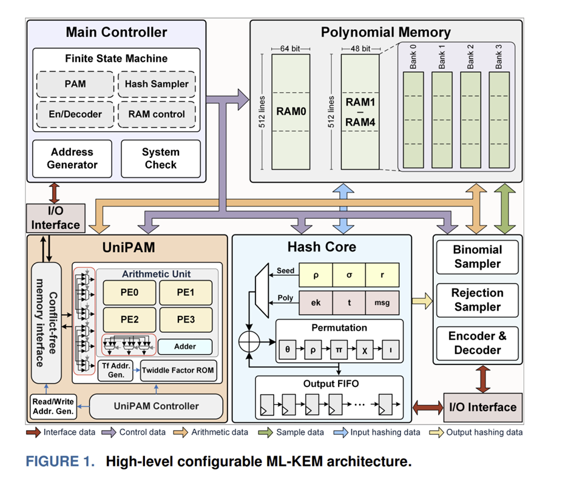

# FPGA:ML-KEM

## ML-KEM完整流程：
### KeyGen(密钥生成):  
种子 → **[`Hash`]** → (ρ,σ) → **[`Sample(采样)`]** → (A,s,e) → **[`NTT(数论变换)`]** → pk/sk

### Encaps(封装):  
pk + 随机数 → **[`Hash+Sample`]** → (r,e1,e2) → **[`NTT+点乘`]** → ct + ss

### Decaps(解封装):  
ct + sk → **[`InvNTT+unzip`]** → 恢复明文 → **[`Hash`]** → ss

## ML-KEM系统实现架构图

## 当前项目实现的模块
项目主要实现了图中 **UniPAM**（Unified Polynomial Arithmetic Module）的核心部分以及**Polynomial Memory**中的一个RAM(只实现了一个RAM进行NTT的验证，无模块集成与架构设计)。

| 架构图模块 | 项目文件 | 对应关系 |
|-----------|---------|---------|
| **UniPAM - Arithmetic Unit** | Butterfly.v | 蝶形运算单元（NTT核心） |
| **UniPAM - PE0~PE3** | ModAdd.v, ModSub.v, ModMul.v | 模运算处理单元 |
| **UniPAM - Twiddle Factor ROM** | TwiddleROM.v | 旋转因子存储 |
| **UniPAM Controller** | NTT_Control.v | NTT流程控制FSM |
| **Polynomial Memory (部分)** | KyberRAM.v | 单RAM，多项式系数存储，验证工具，尚未模块化集成 |
| **Main Controller** | Kyber_NTT_Top.v | 顶层集成，目前作为仿真验证工具，尚未模块化集成 |
| **Main Controller**| tb_ntt_top.v | 目前仿真硬件，未来需由FPGA 板卡上的晶振芯片提供 |

## 项目中尚未实现的关键模块

### 1️⃣ **Hash Core（哈希核心）**
### 2️⃣ **Binomial Sampler（二项式采样器）**
### 3️⃣ **Rejection Sampler（拒绝采样器）**
### 4️⃣ **Encoder & Decoder（编解码器）**
### 5️⃣ **System Check & Address Generator（参数验证、地址映射、总线仲裁）**

## 项目关键功能实现情况

#### 阶段 1：数学核心（✅ 已完成）
#### 阶段 2：随机数与采样（🔴 当前缺失）
#### 阶段 3：哈希与 KDF（🔴 当前缺失）
#### 阶段 4：顶层集成与优化（🔴 当前缺失）

**总结**：**项目目前实现了 `[NTT]` 步骤**，相当于完成了 ~15% 的工作。是一个仿真验证正确的**数学运算核心**，但离完整的 ML-KEM 还有：哈希模块（30%）、采样器（20%）、编解码（15%）、协议逻辑（20%）需要补充。

